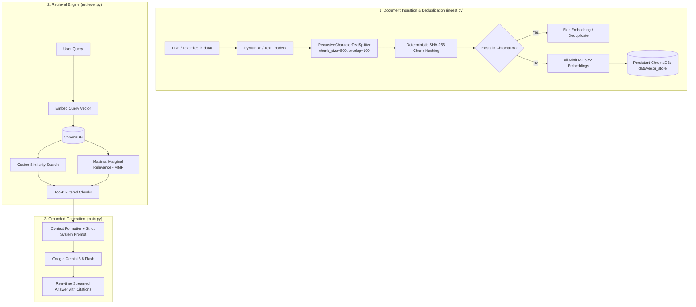

# Traditional RAG Pipeline

A production-ready **Traditional Retrieval-Augmented Generation (RAG)** pipeline built with **Python**, **ChromaDB**, **SentenceTransformers**, and **Google Gemini** (via LangChain).

This system allows you to ingest technical PDF and text documents, index them using local dense vector embeddings with automated deduplication, perform similarity search or diverse MMR retrieval, and generate accurate, grounded answers with strict source citations.

---

## Architecture



---

## Features

- **Multi-Format Document Ingestion**: Loads PDFs using PyMuPDF and text files with metadata tracking (source file, page numbers).
- **Smart Incremental Ingestion**: Uses deterministic SHA-256 fingerprinting for chunks. Only new documents/chunks are embedded, skipping duplicates to save computation.
- **Local Dense Vector Embeddings**: Uses `sentence-transformers/all-MiniLM-L6-v2` locally (no external embedding API key needed).
- **Multiple Retrieval Strategies**:
  - **Standard Similarity Search**: Ranked cosine similarity scoring.
  - **Maximal Marginal Relevance (MMR)**: Balances query relevance with chunk diversity to avoid repetitive context.
  - **Score Threshold Filtering**: Discards low-relevance chunks below a confidence cutoff.
- **Grounded LLM Generation**: Powered by `langchain-google-genai` with streaming output, anti-hallucination guardrails, and inline document citations.

---

## Project Structure

```text
traditional_rag/
│
├── data/
│   ├── text_files/                         # Text source documents
│   ├── pdf_files/                          # PDF source documents
│   └── vecor_store/                        # Persistent ChromaDB storage
│
├── documents/
│   └── how_to_use_rag_pipeline.md          # In-depth technical documentation
│
├── notebook/
│   └── document.ipynb                      # Step-by-step interactive exploration
│
├── ingest.py                               # Document loading, chunking & indexing pipeline
├── retriever.py                            # ChromaDB wrapper, embedding manager & retriever
├── main.py                                 # End-to-end CLI for querying and LLM generation
├── .env.example                            # Environment variables template
├── pyproject.toml                          # Project metadata and dependencies
└── README.md                               # Project overview and quickstart
```

---

## Getting Started

### 1. Prerequisites

- Python 3.12+
- [`uv`](https://github.com/astral-sh/uv) (recommended) or standard `pip`

### 2. Installation

Clone the repository and install dependencies using `uv`:

```powershell
# Clone the repository
git clone https://github.com/abs001/traditional_rag.git
cd traditional_rag

# Install all dependencies into virtual environment
uv sync
```

Or with `pip`:

```powershell
python -m venv .venv
.\.venv\Scripts\Activate.ps1
pip install -r requirements.txt
```

### 3. Environment Configuration

Copy [.env.example](file:///h:/AI/traditional_rag/.env.example) to `.env`:

```powershell
cp .env.example .env
```

Open `.env` and add your Google Gemini API key:

```env
# Get a free API key at: https://aistudio.google.com/app/apikey
GEMINI_API_KEY=your_gemini_api_key_here
```

---

## Usage

### 1. Ingest Documents into Vector Store

Add your documents into `data/pdf_files/` or `data/text_files/`, then run:

```powershell
# Incremental ingestion (automatically skips already indexed chunks)
uv run python ingest.py

# Wipe and re-index the entire collection from scratch
uv run python ingest.py --reset
```

---

### 2. Query and Generate Answers (`main.py`)

Ask questions against the ingested documents and receive streaming answers grounded in context:

```powershell
# Basic query
uv run python main.py --query "how swift engine works"
```

#### Advanced Options:

```powershell
# Retrieve top 4 chunks using MMR for diverse context
uv run python main.py --query "What is the function of the crankshaft?" --top-k 4 --mmr

# Filter out chunks below similarity score threshold (0.0 to 1.0)
uv run python main.py --query "How does the starter motor work?" --threshold 0.5

# Custom temperature and model
uv run python main.py --query "Explain the four stroke cycle" --model "gemini-3.8-flash" --temperature 0.1

# Retrieval only (skip LLM invocation)
uv run python main.py --query "how swift engine works" --no-llm

# Disable streaming
uv run python main.py --query "how swift engine works" --no-stream
```

---

## Programmatic API Usage

You can import and use the pipeline directly inside your Python applications:

```python
from retriever import VectorStore, EmbeddingManager, RAGRetriever

# 1. Connect to Vector Store
vector_store = VectorStore(
    collection_name="pdf_documents",
    persist_directory="data/vecor_store"
)
embedding_mgr = EmbeddingManager(model_name="all-MiniLM-L6-v2")

# 2. Initialize Retriever
retriever = RAGRetriever(vector_store=vector_store, embedding_manager=embedding_mgr)

# 3. Retrieve scored documents
scored_docs = retriever.retrieve_with_scores(
    query="How does the compression stroke work?",
    top_k=3,
    score_threshold=0.4
)

for doc, score in scored_docs:
    print(f"[{score:.4f}] {doc.metadata.get('source')} (Page {doc.metadata.get('page')})")
    print(doc.page_content)

# 4. Generate formatted prompt context
context_str = retriever.format_context([doc for doc, _ in scored_docs])
```

---

## License

This project is licensed under the MIT License.
