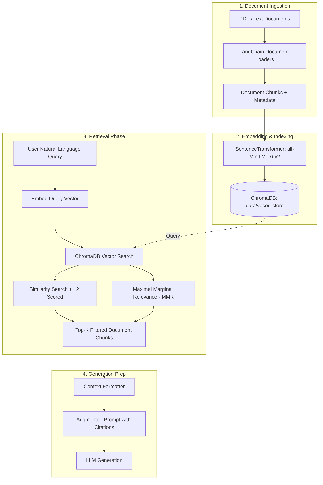
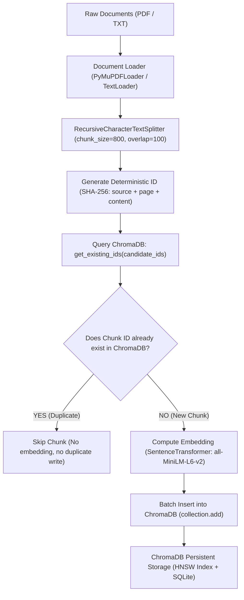

# Traditional RAG Pipeline: Usage Guide

This document provides a comprehensive guide on how to configure, run, and extend this **Traditional Retrieval-Augmented Generation (RAG)** pipeline.

---

## 1. Architecture Overview

A Traditional RAG pipeline augments Large Language Models (LLMs) with private or domain-specific knowledge stored in a vector database.



### Key Components
| Component | Module | Purpose |
|---|---|---|
| **Document Loaders** | `langchain_community.document_loaders` (`PyMuPDFLoader`, `DirectoryLoader`, `TextLoader`) | Reads raw PDFs and text files with metadata (e.g. source, page). |
| **Embedding Manager** | `retriever.EmbeddingManager` | Encodes text into 384-dimensional dense vectors using `all-MiniLM-L6-v2`. |
| **Vector Store** | `retriever.VectorStore` | Persists embeddings, chunk texts, and metadata in ChromaDB (`data/vecor_store/`). |
| **Retriever** | `retriever.RAGRetriever` | Handles similarity search, similarity score normalization, MMR diversity retrieval, and prompt context formatting. |
| **CLI Demo** | `main.py` | Command-line interface to execute queries against the vector store. |
| **Interactive Notebook**| `notebook/document.ipynb` | Step-by-step notebook walking through every phase of the pipeline. |

---

## 2. Directory Structure

```text
traditional_rag/
│
├── data/
│   ├── how_car_engine_works.txt            # Raw text sample
│   ├── text_files/                         # Text documents directory
│   ├── pdf_files/                          # PDF source documents
│   └── vecor_store/                        # ChromaDB persistent database
│
├── notebook/
│   └── document.ipynb                      # Step-by-step interactive workflow
│
├── documents/
│   └── how_to_use_rag_pipeline.md          # This user guide
│
├── retriever.py                            # Core retrieval and vector store module
├── main.py                                 # Command-line interface for querying
├── requirements.txt                        # Project dependencies
└── pyproject.toml                          # Project configuration
```

---

## 3. Quick Start & Prerequisites

### 3.1 Python Environment
Ensure virtual environment is activated and dependencies are installed:
```powershell
# From project root: h:\AI\traditional_rag
.\.venv\Scripts\Activate.ps1

# Or install dependencies if setting up from scratch:
pip install -r requirements.txt
```

---

## 4. How to Use the Pipeline

### Method A: Command-Line Interface (`main.py`)

You can run queries directly from the command line using `uv run` or your `.venv` python:

#### 1. Basic Query
```powershell
uv run python main.py --query "How does a four-stroke engine cycle work?"
# or:
.\.venv\Scripts\python.exe main.py --query "How does a four-stroke engine cycle work?"
```

#### 2. Specifying Top-K Results
Control the number of retrieved chunks (default is 3):
```powershell
uv run python main.py --query "What is the function of the crankshaft?" --top-k 2
```

#### 3. Maximal Marginal Relevance (MMR) for Diversity
MMR balances query relevance with diversity across candidate chunks to prevent repetitive context:
```powershell
.\.venv\Scripts\python.exe main.py --query "What are the key engine parts?" --top-k 3 --mmr
```

#### 4. Applying a Minimum Similarity Score Threshold
Filter out chunks that fall below a confidence cutoff (0.0 to 1.0):
```powershell
.\.venv\Scripts\python.exe main.py --query "How does the starter motor work?" --threshold 0.5
```

#### 5. End-to-End LLM Generation (Google Gemini)
Queries the vector store, creates the grounded prompt, and streams the answer using Gemini:
```powershell
uv run python main.py --query "how swift engine works"
```
Customizing model, temperature, or retrieval-only mode:
```powershell
# Custom model & temperature
uv run python main.py --query "Explain the compression stroke" --model "gemini-2.5-flash" --temperature 0.1

# Retrieval only without LLM invocation
uv run python main.py --query "how swift engine works" --no-llm
```

---

### Method B: Python API (`retriever.py`)

You can import and use `RAGRetriever` in any Python script or web application:

```python
from retriever import RAGRetriever, VectorStore, EmbeddingManager

# 1. Connect to the existing vector store
vector_store = VectorStore(
    collection_name="pdf_documents",
    persist_directory="data/vecor_store"
)

# 2. Initialize embedding manager
embedding_mgr = EmbeddingManager(model_name="all-MiniLM-L6-v2")

# 3. Create the retriever
retriever = RAGRetriever(vector_store=vector_store, embedding_manager=embedding_mgr)

# 4. Standard Retrieval with Normalized Similarity Scores
query = "What is the difference between intake and exhaust valves?"
scored_results = retriever.retrieve_with_scores(query=query, top_k=3)

for doc, score in scored_results:
    print(f"Similarity Score: {score:.4f}")
    print(f"Source: {doc.metadata.get('source')} | Page: {doc.metadata.get('page')}")
    print(f"Content: {doc.page_content.strip()}\n")

# 5. Diverse Retrieval with MMR
diverse_docs = retriever.retrieve_mmr(
    query=query,
    top_k=3,
    fetch_k=10,
    lambda_mult=0.6  # 1.0 = pure relevance, 0.0 = pure diversity
)

# 6. Format Retrieved Documents for an LLM Prompt
llm_context = retriever.format_context(diverse_docs)
print("=== Formatted LLM Context ===")
print(llm_context)
```

---

### Method C: Interactive Jupyter Notebook (`notebook/document.ipynb`)

1. Open `notebook/document.ipynb` in your IDE or JupyterLab.
2. Select the `.venv` Python kernel.
3. Run through sections 1 to 4 to review document loading, chunking, and embedding creation.
4. Scroll to **Section 5: Retrieval Pipeline** to run queries, test MMR diversity, and inspect augmented prompt formatting interactively.

---

## 5. ChromaDB Data Insertion Flow (Step-by-Step)

The data insertion flow ensures documents are cleanly parsed, split into semantically coherent passages, deduplicated, vectorized, and indexed into the ChromaDB vector store.

### 5.1 Insertion Workflow Architecture



### 5.2 Step-by-Step Insertion Breakdown

1. **Document Ingestion & Discovery**:
   - Scans `data/pdf_files/` for `.pdf` documents using `PyMuPDFLoader` (extracts text and records `page` index and document properties).
   - Scans `data/text_files/` and `data/` for `.txt` files using `TextLoader` with UTF-8 decoding.

2. **Semantic Text Chunking**:
   - Long documents are split using `RecursiveCharacterTextSplitter` into chunks of 800 characters with a 100-character overlap.
   - Preserves sentence boundaries and paragraph structures while keeping metadata (`source`, `page`, `file_name`) attached to each chunk.

3. **Deterministic Chunk Hashing (`generate_deterministic_id`)**:
   - Rather than assigning volatile random UUIDs, each chunk is assigned a deterministic SHA-256 fingerprint:
     $$\text{ID} = \text{doc\_\{filename\}\_p\{page\}\_}\{\text{SHA256}(\text{source}::\text{page}::\text{content})[:16]\}$$
   - This ensures the exact same chunk will **always produce the exact same ID** across multiple ingestion runs.

4. **ChromaDB Existence Check (`collection.get(ids=...)`)**:
   - Queries the collection with candidate IDs:
     ```python
     existing_records = self.collection.get(ids=candidate_ids)
     existing_ids = set(existing_records.get("ids", []))
     ```
   - Separates truly new chunks from already-indexed chunks.

5. **Deduplication & Resource Conservation**:
   - Chunks already present in ChromaDB are **skipped immediately**.
   - Vector embedding generation (which is CPU/GPU intensive) is performed **only for new, unindexed chunks**.

6. **Embedding Generation**:
   - New chunk texts are passed to `EmbeddingManager.generate_embeddings()` (`all-MiniLM-L6-v2`) generating 384-dimensional dense float vectors.

7. **Atomic ChromaDB Persistence**:
   - The new IDs, embeddings, metadata, and document texts are committed via `collection.add(...)`:
     ```python
     self.collection.add(
         ids=new_ids,
         documents=new_texts,
         metadatas=new_metadatas,
         embeddings=new_embeddings
     )
     ```
   - Automatically flushed to disk at `data/vecor_store/chroma.sqlite3` and the underlying HNSW binary graph index.

---

### 5.3 How to Insert Data If Not Exists

#### Option 1: Automated CLI Ingestion ([ingest.py](file:///h:/AI/traditional_rag/ingest.py))
Run the unified script. By default with `--no-reset`, it skips chunks that already exist:

```powershell
# Ingest with deduplication (skips existing chunks)
uv run python ingest.py --no-reset

# Fresh wipe and re-index
uv run python ingest.py --reset
```

#### Option 2: Programmatic Usage in Python or Notebook

```python
from retriever import VectorStore, EmbeddingManager
from langchain_community.document_loaders import TextLoader
from langchain_text_splitters import RecursiveCharacterTextSplitter

# 1. Connect to Vector Store
vector_store = VectorStore(
    collection_name="pdf_documents",
    persist_directory="data/vecor_store"
)
embedding_mgr = EmbeddingManager(model_name="all-MiniLM-L6-v2")

# 2. Load and split new document
loader = TextLoader("data/text_files/maruti_suzuki_swift_engine.txt", encoding="utf-8")
docs = loader.load()
splitter = RecursiveCharacterTextSplitter(chunk_size=800, chunk_overlap=100)
chunks = splitter.split_documents(docs)

# 3. Insert ONLY if not already present
stats = vector_store.add_documents_if_not_exists(
    documents=chunks,
    embedding_manager=embedding_mgr
)

print(f"Total Checked: {stats['total_checked']}")
print(f"New Inserted:  {stats['inserted']}")
print(f"Skipped Dups:  {stats['skipped']}")
```

---

## 6. Downstream LLM Integration (Augmentation & Generation)

Once `retriever.format_context(...)` produces the retrieved context, pass it to your LLM prompt:

```python
prompt_template = f"""You are a helpful assistant. Use only the following context to answer the user's question accurately.

Context:
{retriever.format_context(retrieved_docs)}

Question: {user_query}
Answer:"""

# Send prompt_template to your LLM (OpenAI, Gemini, Ollama, Anthropic, etc.)
```
